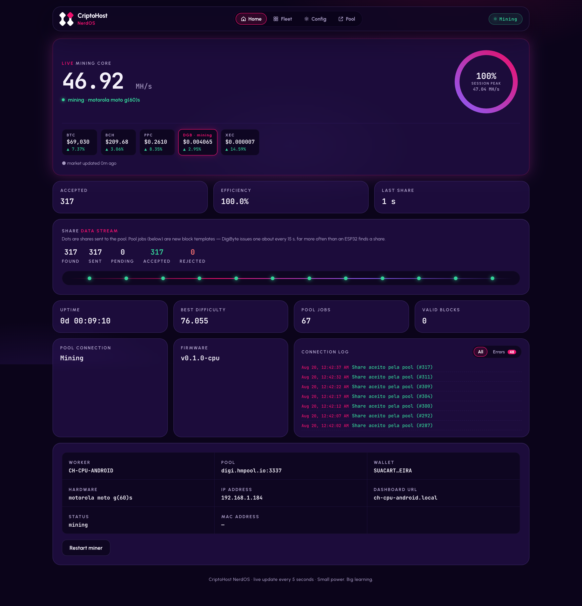
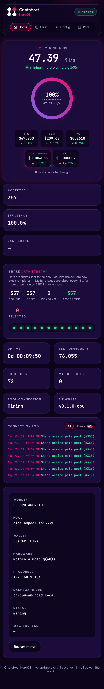
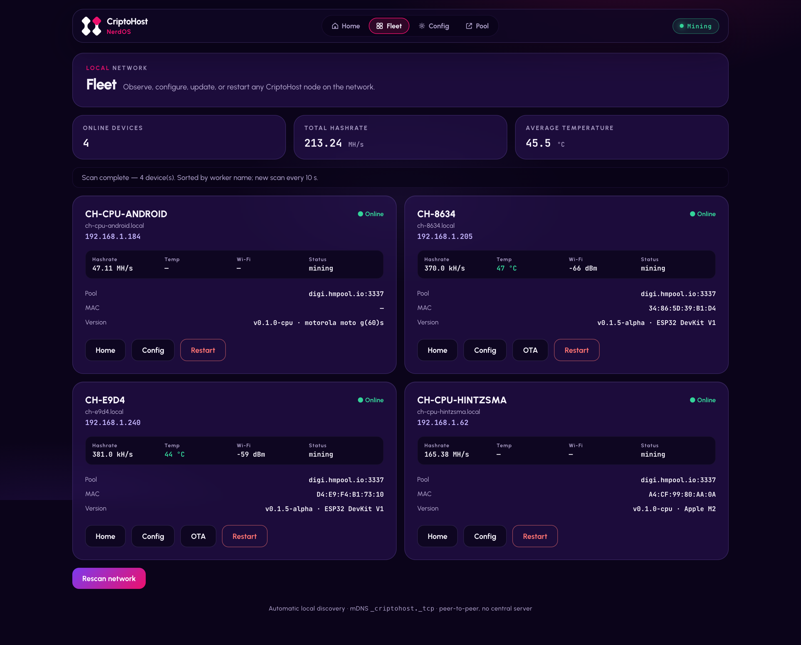
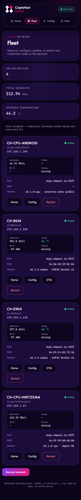
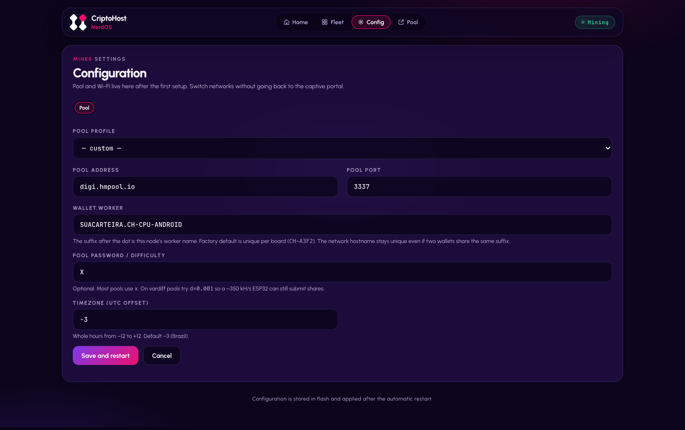
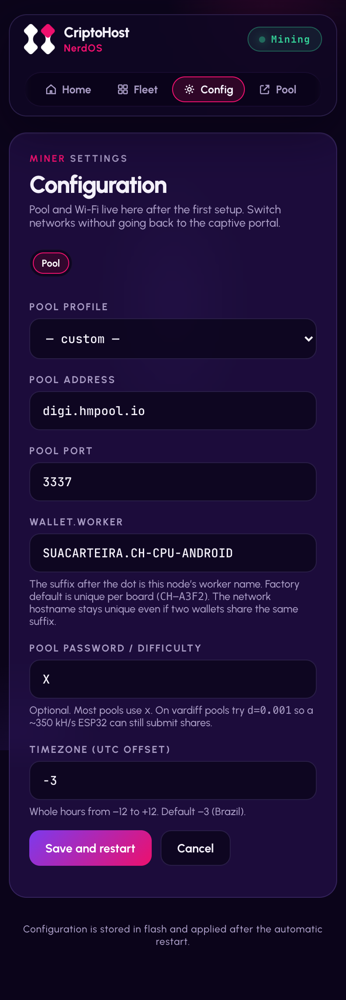

<div align="center">

# 📱 CriptoHost Mobile

**Phones on the CriptoHost fleet — Android mining via Termux, iOS as the control panel. No app stores.**

[🇧🇷 Português](README.md) · 🇺🇸 English

[](LICENSE)
[](https://github.com/criptohost/criptohost_cpuminer)

*A [Cripto Host](https://cripto.host) product — "Mining made easy"*

</div>

---

## 🧭 What is this?

The mobile layer of the CriptoHost ecosystem: it puts **Android to work mining real SHA-256d** (via [Termux](https://f-droid.org/packages/com.termux/), outside the Play Store) and turns **iPhone/iPad into the fleet's control panel** (PWA, straight from Safari). The mining core is [criptohost_cpuminer](https://github.com/criptohost/criptohost_cpuminer) — this repo is the bootstrap and platform docs.

> ⚠️ **Honest framing**: hobby and education. A moto g(60)s does ~47 MH/s (dropping with thermal throttle); an ASIC does 200 TH/s. Mine plugged in, for the learning — expected return is ~zero.

## ✨ What it does

- 🤖 **Android as a full mining node** — built with ARMv8 crypto extensions (same fast path as Apple Silicon), same CLI menu as the PCs, dashboard on port 8091
- 📲 **No store, no root** — the Play Store bans mining; the path is Termux via F-Droid
- 🍎 **iOS as a panel** — any node on your network becomes an app via "Add to Home Screen" (on-device mining on iOS is banned by Apple — [details](docs/IOS.en.md))
- 🕸️ **Same fleet** — the phone shows up on the Fleet next to boards, Macs and servers (mDNS + static peers)
- 🌡️ **Thermal-aware** — thread, wake-lock and battery guidance in the [Android guide](docs/ANDROID.en.md)

## 🖼️ Screens

Real captures from a motorola moto g(60)s mining at ~47 MH/s via Termux.

| | Desktop | Mobile |
|---|---|---|
| **Home** |  |  |
| **Fleet** |  |  |
| **Config** |  |  |

## 🚀 Up and running in 5 minutes

### 🤖 Android (miner)

1. Install **Termux from [F-Droid](https://f-droid.org/packages/com.termux/)** (the Play Store build doesn't work).
2. In Termux:
   ```bash
   curl -fsSL https://raw.githubusercontent.com/criptohost/criptohost_mobile/main/setup-termux.sh | bash
   ```
3. Mine:
   ```bash
   termux-wake-lock
   cd ~/criptohost_cpuminer && ./ch/mine.sh
   ```
4. Menu option **[2]** = dashboard at `http://<phone-ip>:8091`. 🎉

Full guide (per-device performance, battery, Doze): [docs/ANDROID.en.md](docs/ANDROID.en.md).

### 🍎 iOS (fleet panel)

1. Safari → open any node on your network (`http://ch-8634.local` or `http://<ip>:8091`).
2. Share → **Add to Home Screen**.
3. CriptoHost icon on your home screen, full-screen standalone app. Why iPhones don't mine: [docs/IOS.en.md](docs/IOS.en.md).

## 🕸️ The fleet (and its siblings)

| Repository | What it mines | Typical hashrate |
|---|---|---|
| [criptohost_nerdos](https://github.com/criptohost/criptohost_nerdos) | ESP32 (DevKit V1, S3, T-Display) | ~350 kH/s |
| [criptohost_cpuminer](https://github.com/criptohost/criptohost_cpuminer) | Windows, Linux and macOS (CPU) | 20–165 MH/s |
| **criptohost_mobile** (this one) | Android via Termux (iOS = panel) | ~47 MH/s |

Android multicast usually blocks mDNS discovery — use **static peers** (`ch/peers.conf` in the cpuminer repo, one `ip[:port]` per line) so the phone can see and be seen.

## ❓ Honest questions

**Why isn't there a store app?** Play Store and App Store ban mining apps — and our philosophy is local, no middlemen anyway. **Does it hurt the battery?** Mining while hot does degrade batteries — stay plugged in, use fewer threads. **Will iPhones ever mine?** Not without jailbreak/dev-cert — Apple policy, not our limitation ([details](docs/IOS.en.md)).

## 🧑‍💻 For developers

Why this repo is **not a fork** (we evaluated [termux-miner](https://github.com/wong-fi-hung/termux-miner) and kept a single mining core in the cpuminer): see [docs/ANDROID.en.md](docs/ANDROID.en.md) and the decision history in commits. The actual Android build lives in [`ch/build-android.sh` in the cpuminer repo](https://github.com/criptohost/criptohost_cpuminer/blob/main/ch/build-android.sh).

## 📜 License, trademark and credits

- **This repo's scripts and docs**: [MIT](LICENSE). Installed components keep their licenses (cpuminer-opt: GPL-2.0).
- **Trademark**: free code, protected brand — the ecosystem's [BRANDING.md](https://github.com/criptohost/criptohost_nerdos/blob/main/BRANDING.md).

## 💬 Contact

Questions, ideas or partnerships: **fale@cripto.host** · Issues and PRs welcome.

---

<div align="center">

*Small power. Big learning.* 💜

</div>
